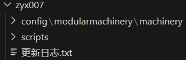
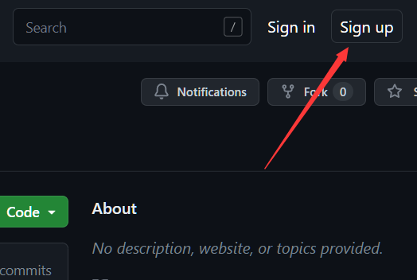
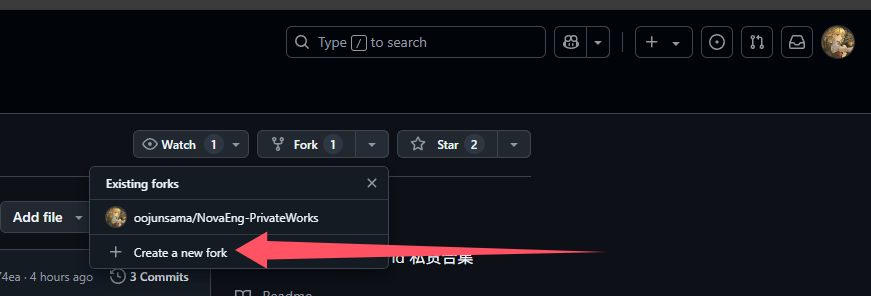
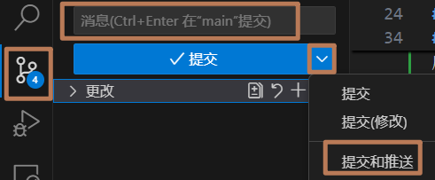
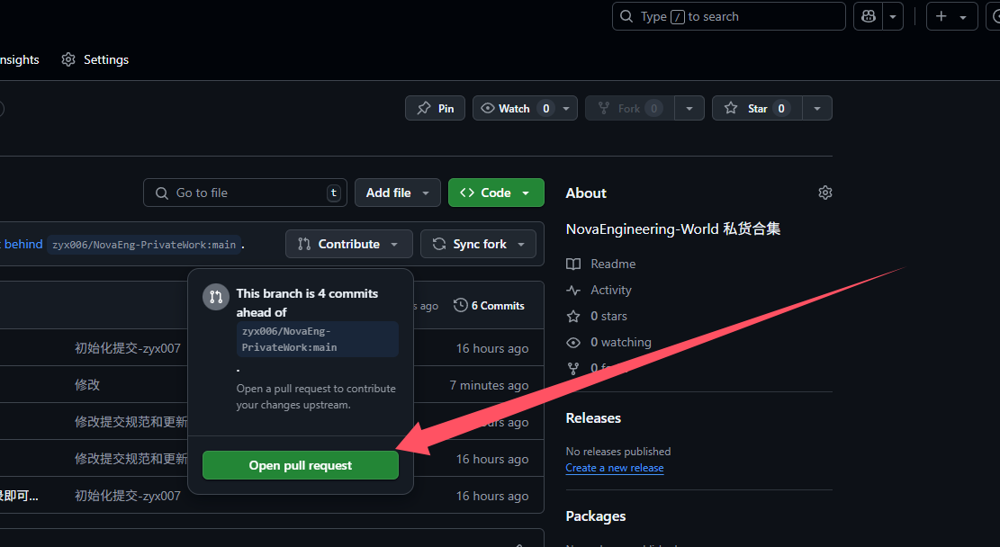

## 提交commit前请检查你的修改：

1、请尽量只在自己的目录内修改，如用户abc尽量只修改目录abc内的私货内容，各自的目录内必须存在config\modularmachinery\machinery和scripts完整目录结构（除非你没有相关内容，比如没有机器结构则不需有config/**），如图：

2、机器结构(.json)和代码文件(.zs)的命名必须由 用户名(游戏名)-私货名  组成，如zyx007-vacuum_dryer.json、zyx007-vacuum_dryer.zs

3、每人的目录内必须有单独的"更新日志.txt"，每次提交修改前必须修改"更新日志.txt"用以描述你的私货的修改（尽量每版本单独修改更新日志并提交），且不要随意修改他人的更新日志内容，每次更新日志用空行隔开，格式如下：

(注：更新日志首行建议增加QQ号方便玩家反馈bug)

    QQ：xxxx

    ……
    
    2025/04/09 私货名 v1.0
    详细描述
    
    ……

4、Git commit消息尾记得带上你的用户名/游戏名，用-连接

## 🛠️ 提交PR的方法

通常来说，在Github上我们以Pull Request（拉取请求）的方式来提交自己的改动，得益于Github完善的设计，整个提交过程你完全可以图形化的完成。

### 📝1、登录

要在Github上进行操作，你首先要拥有一个账号，你可以在网站的右上角进行注册后使用该账号登录。

### 📋2、分支仓库

由于你并没有直接修改本仓库的权限，所以在进行修改前，你需要在你的账号名下基于本仓库创建一个分支仓库，这是一个内容与本仓库当前版本完全一致的仓库，并且会标记出分支的来源，这个仓库将是一个你真正可以随意修改的仓库。
要创建一个分支仓库，你只需要点击右上角的`Fork`

随后你就可以开始分支流程，并最终跳转到你创建的仓库。

### 📜3、修改分支

此时你就可以对自己的分支仓库进行修改了，修改也可以以多种方式进行，你可以直接在网页上对文件进行修改，或创建和删除文件，你也可以使用 VSCode 来将文件克隆至本地，然后直接在本地进行修改。

修改后，你需要在 VSCode 的`源代码管理`中填写commit消息，随后点击下三角菜单内`提交和推送`将修改推送到你的fork仓库中。

当然这边有很多软件可以方便你的修改如<strong>[github desktop](https://desktop.github.com/download/)</strong>与<strong>[gitkraken](https://www.c.com/)</strong>。

之后你就可以在自己的分支仓库看到Open Pull Request的按钮

点击它，你就可以开启拉取请求的流程，它最终会被提交给我们，我们进行合并后，你的修改就会在合集仓库中可见了。

## 👨‍💻开发推荐
建议使用 [VSCode](https://code.visualstudio.com/) 克隆你所fork的仓库进行开发，并安装 `Chinese (Simplified)`、`ZenScript IntelliSense` 和 `Minecraft Color Highlighter` 插件辅助开发。